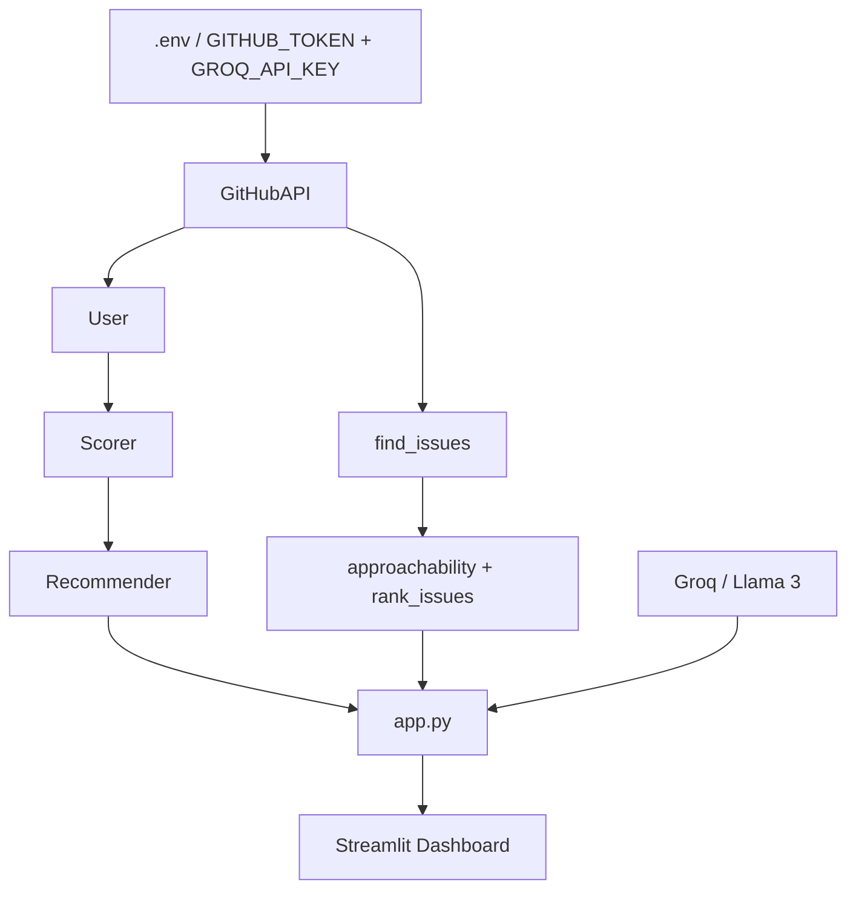

# GitGauge

GitHub Profile Auditor and Beginner Issue Finder

GitGauge scores your GitHub profile against recruiter-visible criteria, tells you
what to fix, and finds beginner-friendly open-source issues to work on next.
The entire interface is a Streamlit browser app powered by a six-class Python engine.

---

## Table of Contents

- [Overview](#overview)
- [Features](#features)
- [How It Works](#how-it-works)
- [Architecture](#architecture)
- [File Structure](#file-structure)
- [Tech Stack](#tech-stack)
- [Getting Started](#getting-started)
- [Usage](#usage)
- [Scoring Methodology](#scoring-methodology)
- [Honest Limitations](#honest-limitations)
- [What's Next](#whats-next)

---

## Overview

I built GitGauge to solve a problem I noticed: most CS students applying for
internships have GitHub profiles that are weak not because they cannot code, but
because they do not know what a recruiter actually looks at. Empty descriptions,
stale repos, no bio, no real contributions outside their own account.

GitGauge fixes that in two ways. The audit mode scores your profile and tells you
exactly what to fix. The Find Me Work mode searches GitHub for real open issues
tagged as beginner-friendly and ranks them by how approachable they are. If your
profile is weak on contributions, you get a direct list of places to start — the
tool closes its own loop.

---

## Features

| Feature | Description |
|---|---|
| Profile Score | Scores a GitHub profile out of 100 across five weighted categories |
| Letter Grade | A+, A, B, C, or Needs Work based on the overall score |
| Per-Repo Health | Every repository scored individually out of 100 |
| Language Breakdown | Language percentages across original non-fork repos |
| Score Breakdown | Exactly where points were earned and lost per category |
| Priority Recommendations | HIGH, MEDIUM, and LOW fixes with problem, reason, and action |
| Recruiter Summary | Strengths and weaknesses in plain language |
| Issue Finder | Searches GitHub for open good-first-issue tickets by language |
| Approachability Ranking | Ranks issues by comment count and age |
| AI Summary | Llama 3 via Groq summarises the score breakdown and recommendations |
| Streamlit Dashboard | Four-tab browser interface powered by the core engine |

---

## How It Works

**Audit mode:**

1. Fetch — pulls profile info and up to 100 public repos from the GitHub API
2. Score — evaluates each repo individually then rolls up to an overall profile score
3. Breakdown — shows earned vs maximum points per category and per repo
4. Advise — ranks weakest areas and generates prioritised recommendations
5. Summarise — Llama 3 via Groq writes a plain summary of the score and fixes
6. Cache — Streamlit caches results for one hour for instant repeat lookups

**Find Me Work mode:**

1. Search — queries GitHub for open issues labelled good first issue in your language
2. Score — rates each issue by comment count and age
3. Sort — orders them by approachability score, best first
4. Display — shows the top 10 with direct links

---

## Architecture



The core engine has no dependency on Streamlit. All six classes operate
independently of the UI layer. app.py imports from the classes — the classes
never import from app.py.

---

## File Structure

```
GitGauge/
├── github_api.py     — All GitHub API communication
├── models.py         — Repo and User classes
├── scorer.py         — Scorer class
├── recommender.py    — Recommender class
├── issues.py         — Issue search, approachability scoring, ranking
├── app.py            — Streamlit browser interface
├── .env              — GITHUB_TOKEN and GROQ_API_KEY (never committed)
└── .gitignore        — .env, __pycache__, *.pyc
```

---

## Tech Stack

- Python 3.7+
- GitHub REST API
- `urllib` for HTTP requests (built-in, no requests library)
- `datetime`, `json`, `os`, `collections` — all built-in
- Streamlit for the browser interface
- Groq for Llama 3 AI summary

---

## Getting Started

### Prerequisites

- Python 3.7+
- A free GitHub Personal Access Token from github.com/settings/tokens
  (no scopes needed for public data)
- A free Groq API key from console.groq.com

### Installation

```bash
git clone https://github.com/yourusername/gitgauge.git
cd gitgauge
pip install streamlit groq python-dotenv
```

### Configuration

Create a `.env` file in the project root:

```
GITHUB_TOKEN=your_github_token_here
GROQ_API_KEY=your_groq_api_key_here
```

This file is listed in `.gitignore` and is never committed.

---

## Usage

```bash
streamlit run app.py
```

Opens in the browser at `http://localhost:8501` with four tabs:

| Tab | Contents |
|---|---|
| Profile | Score, grade, language chart, bio, follower count, AI summary |
| Score Breakdown | Per-category progress bars, repo health score table |
| Recruiter Summary | Strengths, weaknesses, expandable recommendation cards |
| Find Me Work | Ranked beginner issues as clickable cards |

---

## Scoring Methodology

All scores are transparent heuristics based on observable signals. Nothing is
AI-generated or predicted in the scoring. Every number can be traced back to
the raw API data.

**Profile score — five categories totalling 100 points:**

| Category | What is measured |
|---|---|
| Profile Quality | Bio present, has followers, account age |
| Documentation | Percentage of repos with a description |
| Activity | Percentage of repos pushed to in the last 6 months |
| Repository Quality | Average health score across all repos |
| Originality | Percentage of repos that are not forks |

**Per-repo health score — five criteria totalling 100 points:**

| Criterion | What is measured |
|---|---|
| Documentation | Repo has a non-empty description |
| Activity | Pushed to in the last 6 months |
| Popularity | Has at least one star |
| Originality | Not a fork |
| Completeness | Has open issues, which signals active development |

**Issue approachability:**
Scored from comment count (fewer is less crowded) and issue age (newer is more
likely to have active maintainers). This is an estimate, not a prediction.

**AI summary:**
Llama 3 via Groq receives the score, grade, breakdown, and top three
recommendation titles and writes a 3-4 sentence summary. The LLM handles
language generation only — all scoring and ranking logic is in Python.

---

## Honest Limitations

GitGauge scores presentation, not engineering quality. A high score means the
profile looks good in a recruiter's 10-second skim. It says nothing about code
quality, algorithm depth, or actual skill.

Up to 100 repos are fetched. Accounts with more than 100 repos only have the
first 100 analysed.

Public repos only. Private repositories are not accessible without additional
OAuth scopes.

Approachability is an estimate. Issue ranking is based on signals observable
from the API. It does not account for how fast a maintainer responds or the
internal culture of a project.

Language detection is GitHub's own. Percentages reflect how GitHub classifies
each repository, which occasionally misclassifies mixed-content repos.

If the Groq API is unavailable the AI summary section shows a short caption.
All other features continue to work — the summary is a display enhancement,
not a core dependency.

---

## What's Next

Stage 2 adds cohort mode — score an entire group of GitHub profiles, rank each
person by percentile across categories, visualise the cohort distribution, and
export individual reports as Markdown files. Built on Pandas and NumPy.
